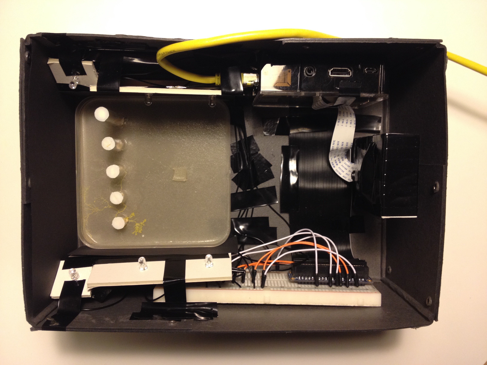

#Project Slime Mold

***First confrontation and encounter with computer vision, based on the behavior of slime mold and the first steps with Raspberry Pi 2.***

Normally one finds Physarum polycephalum in nature in a humid environment, on trees under the bark or in leaf litter in the forest, where they can feed on bacteria, fungal spores, and more. But we used the slime mold for an unpredictable experiment.

The first step of the project was to think about an experiment with the slime mold and implement this. Then the fungus had to be grown in petri dishes in order to last for several attempts. As the fungus is quick in its growth and the experiment should be recorded for 2-3 days, a recording setup had to be tinkered and programmed.

For the basis of my setup I used the following hardware:

* Raspberry Pi 2 Model B
* Raspberry Pi Camera Rev 1.3
* Adafruit GPIO Ribbon Cable
* Adafruit Assembled Pi Cobbler
* Breadboard
* 6x ultra bright white LEDs
* Various cables
* Box

I used Crontab for the automatic recording of the experiment, that activates the LEDs for a short moment and takes a picture every minute. After the experiment, the images are joined together to form a short clip.

##The Experiment

The mold is exposed on the side of the petri dish and it is to be observed:

* how the slime mold is responding on a 90° slope
* if he chooses the food by the lowest resistance
* whether the slime mold works from left to right

After several attempts, unfortunately I had to realize that the experiment has failed. However, I used the recovered material for the computer vision project with OpenCV.

In the following you can see my final result:

This project was created at the University of Applied Sciences Potsdam  
Course: Input/Output - Fundamentals of process-oriented design  
Semester: 2015

##License

The MIT License (MIT)

Copyright (c) 2015 Christopher Klement

Permission is hereby granted, free of charge, to any person obtaining a copy
of this software and associated documentation files (the "Software"), to deal
in the Software without restriction, including without limitation the rights
to use, copy, modify, merge, publish, distribute, sublicense, and/or sell
copies of the Software, and to permit persons to whom the Software is
furnished to do so, subject to the following conditions:

The above copyright notice and this permission notice shall be included in all
copies or substantial portions of the Software.

THE SOFTWARE IS PROVIDED "AS IS", WITHOUT WARRANTY OF ANY KIND, EXPRESS OR
IMPLIED, INCLUDING BUT NOT LIMITED TO THE WARRANTIES OF MERCHANTABILITY,
FITNESS FOR A PARTICULAR PURPOSE AND NONINFRINGEMENT. IN NO EVENT SHALL THE
AUTHORS OR COPYRIGHT HOLDERS BE LIABLE FOR ANY CLAIM, DAMAGES OR OTHER
LIABILITY, WHETHER IN AN ACTION OF CONTRACT, TORT OR OTHERWISE, ARISING FROM,
OUT OF OR IN CONNECTION WITH THE SOFTWARE OR THE USE OR OTHER DEALINGS IN THE
SOFTWARE.
